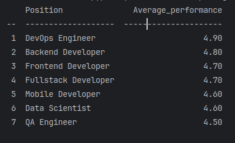

## Генератор отчетов 

### Что нужно сделать?
- Написать скрипт который генерирует отчеты из csv файлов.
- Наша задача запустить скрипт, который генерирует отчеты показывающий
среднюю эффективность работников на каждой позиции(должности).

### Требования
 - [python3.12](https://www.python.org/downloads/release/python-3120)
 - [poetry](https://python-poetry.org/docs/)

### Установка
- Клонируем репозиторий себе на локальную машину ```git clone git@github.com:Nekketsu4/report_generator.git```
- Переходим в папку report_generator ```cd report_generator```
- Устанавливаем зависимости:
    - poetry (bash$```poetry install```)
    - requirements(bash$```pip install -r requirements.txt``)

### Запуск тестов
bash$ ```python -m pytest```

### Запуск сркипта c одним файлом
bash$ ```python -m main --files employees1.csv --report performance```

### Запуск сркипта c несколькими файлами
bash$ ```python -m main --files employees1.csv employees2.csv --report performance```

### Параметры скрипта --files и --report
--files - путь к CSV файлу(параметр обязателен, можно указать сразу несколько файлов)
--report - тип отчета который будет сформирован(в скрипте прописан пока только один performance)

### Пример того как будет выглядеть отчет


### Архитектура проекта

```
report_generator/
+-- src/
|    |---- __init__.py
|    |---- factory.py
|    |---- model.py
|    `---- report.py
|---- tests/
|    |---- __init__.py
|    |---- test_factory.py
|    |---- test_model.py
|    `---- test_report.py
|---- .gitignore
|---- main.py
|---- pyproject.toml
|---- REEADME.MD
`---- requirements.txt
```

### Как добавить новый тип отчета?
1. Пишем новый класс отчета 
```
class NewReport(AbstractReport):
    def load(files: List[T]):
    """Логика для загрузки файлов"""
        pass
    
    def create_report() -> List[Dict[str, Any]]:
    """Логика для обработки загруженных файлов"""
        pass
        
    ... # Дальше своя логика на ваше усмотрение
```
2. Добавьте в фабрику отчетов новый созданный класс
```
def create_factory_report(report_type: str) -> AbstractReport:
    if report_type == 'performance':
        return EmployeeReport()
    elif report_type == 'new_report':
        return NewReport()
    else:
        raise ValueError(f'Данный отчет не найден: {report_type}')
```
3. В argparse добавляем новый аргумент (new_report)
```
arg_parser.add_argument('--report', type=str, required=True,
                        choices=['performance', 'new_report'],
                        help='Указываем какие типы отчетов должны формироваться')
```